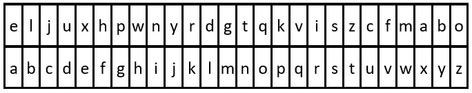

# 2325. Decode the Message

You are given the strings key and message, which represent a cipher key and a secret message, respectively. The steps to decode message are as follows:

1. Use the **first** appearance of all 26 lowercase English letters in key as the order of the substitution table.
2. Align the substitution table with the regular English alphabet.
3. Each letter in message is then **substituted** using the table.
4. Spaces ' ' are transformed to themselves.
- For example, given key = "**happy boy**" (actual key would have **at least one** instance of each letter in the alphabet), we have the partial substitution table of ('h' -> 'a', 'a' -> 'b', 'p' -> 'c', 'y' -> 'd', 'b' -> 'e', 'o' -> 'f').
*Return the decoded message.*




**Input:** key = "the quick brown fox jumps over the lazy dog", message = "vkbs bs t suepuv"
**Output:** "this is a secret"
**Explanation:** The diagram above shows the substitution table.
It is obtained by taking the first appearance of each letter in "**the** **quick** **brown** **f**o**x** **j**u**mps** o**v**er the **lazy** **d**o**g**".






**Input:** key = "eljuxhpwnyrdgtqkviszcfmabo", message = "zwx hnfx lqantp mnoeius ycgk vcnjrdb"
**Output:** "the five boxing wizards jump quickly"
**Explanation:** The diagram above shows the substitution table. It is obtained by taking the first appearance of each letter in **"eljuxhpwnyrdgtqkviszcfmabo"**.



## Explanation
-

## Solution

```cs
public class Solution {
    public string DecodeMessage(string key, string message) {
        Dictionary<char, char> offsetMap = new() 
        {
            { ' ', ' ' }
        };
        char start = (char)96;
        for (int i = 0; i < key.Length; i++)
            if (!offsetMap.ContainsKey(key[i]))
                offsetMap.Add(key[i], ++start);

        char[] decodedLetters = new char[message.Length];
        for (int i = 0; i < message.Length; i++)
            decodedLetters[i] = offsetMap[message[i]];
        return new String(decodedLetters);
    }
}
```
