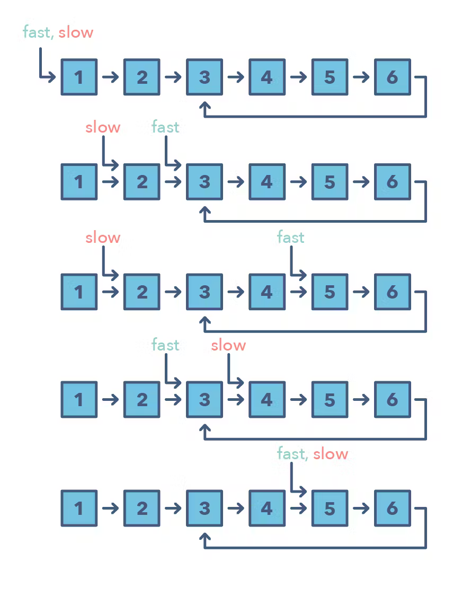

# Fast and Slow pointers

Запускаем два указатель с разным шагом, чаще всего медленный с шагом 1 и быстрый с шагом 2.

## Как можно понять, что возможно использовать
- Надо найти цикл в списке
- Когда нужно найти конкретынй элемент или общую длинну

## Когда стоит использовать вместо Two pointers 
Два указателя нельзя использовать если по входным данных нельзя итерироваться в обратную сторону

## Примеры проблем
- [Linked List Cycle](https://leetcode.com/problems/linked-list-cycle/description/)
- [Palindrome Linked List](https://leetcode.com/problems/palindrome-linked-list/description/)
- Cycle in a Circular Array