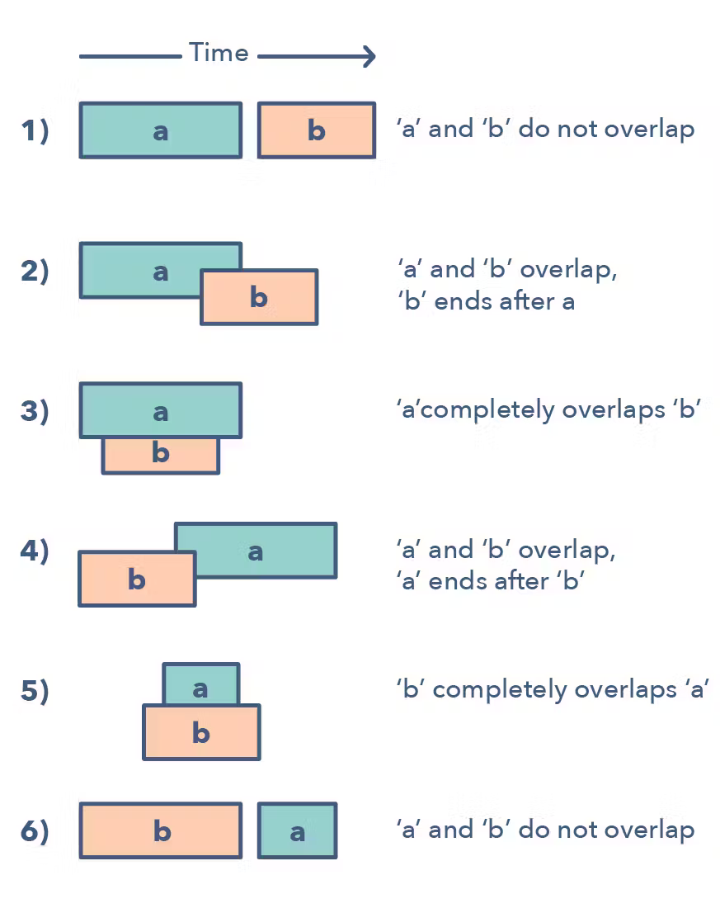

# Merge Intervals

Шаблон Merge Intervals — это эффективный метод работы с перекрывающимися интервалами. Во многих задачах, связанных с интервалами, вам нужно либо найти перекрывающиеся интервалы, либо объединить интервалы, если они перекрываются. Шаблон работает следующим образом:

Если даны два интервала («a» и «b»), то существует шесть различных способов, которыми эти два интервала могут соотноситься друг с другом:

## Как можно понять, что возможно использовать
- Если вас просят составить список только с взаимоисключающими интервалами
- Если вы слышите термин «перекрывающиеся интервалы».

## Примеры проблем
- [Merge Intervals](https://leetcode.com/problems/merge-intervals/description/)
- Maximum CPU Load