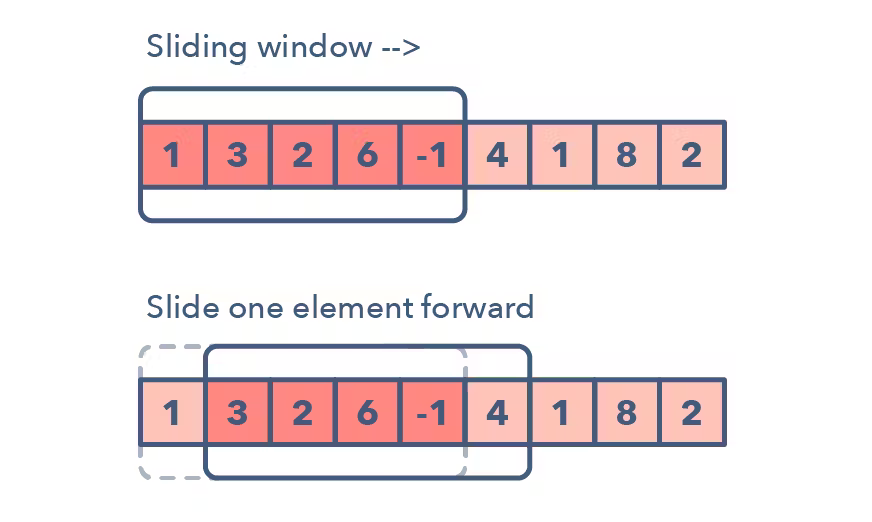

# Sliding window

Представляет собой некоторое окно которое мы двигаем по исходному массиву.

## Как можно понять, что возможно использовать
- Входные данные  представляют линейную структуру: массив, список, строка
- Необходимо найти самый короткий или самый длинный *подмассив*, или конкретное значение

## Примеры проблем
- Maximum sum subarray of size *K*
- Longest substring with *K* distinct characters
- String anagrams